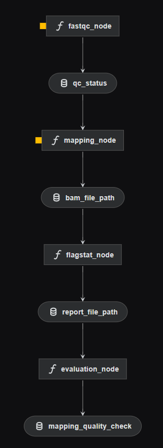

# Домашнее задание 3: Построение пайплайна получения генетических вариантов

**Выполнил:** Вячеслав Александрович  

---

## 1. Исходные данные (NCBI SRA)
В качестве исследуемого организма была выбрана *Escherichia coli* (WGS). 
Использован набор прочтений (Illumina, paired-end) с идентификатором **SRR2584863**.

* **Forward reads:** [SRR2584863_1.fastq.gz](http://ftp.sra.ebi.ac.uk/vol1/fastq/SRR258/003/SRR2584863/SRR2584863_1.fastq.gz)
* **Reverse reads:** [SRR2584863_2.fastq.gz](http://ftp.sra.ebi.ac.uk/vol1/fastq/SRR258/003/SRR2584863/SRR2584863_2.fastq.gz)
* **Референсный геном:** Скачан с NCBI (GCF_000005845.2) и проиндексирован утилитой `minimap2`.

---

## 2. Развертывание фреймворка (Kedro)
В качестве фреймворка для автоматизации пайплайна вместо традиционных bash/Snakemake был выбран **Kedro** — production-ready фреймворк для построения конвейеров данных на Python.

**Инструкция по установке:**
```bash
# 1. Создание и активация виртуального окружения
python3 -m venv venv
source venv/bin/activate

# 2. Установка Kedro и плагина визуализации
pip install kedro kedro-viz

# 3. Проверка установки
kedro --version

```

---

## 3. Тестовый пайплайн "Hello world"

Тестовый запуск базовых возможностей Kedro.

**Код узла и пайплайна (`test_kedro.py`):**

```python
from kedro.pipeline import node, pipeline
from kedro.runner import SequentialRunner
from kedro.io import DataCatalog

# 1. Определяем обычную Python-функцию
def say_hello():
    message = "Hello, Bioinformatics World! Kedro is ready."
    print(message)
    return message

# 2. Создаем Узел (Node), оборачивая функцию
hello_node = node(
    func=say_hello, 
    inputs=None, 
    outputs="hello_output", 
    name="hello_world_node"
)

# 3. Собираем Пайплайн (Pipeline) из одного узла
hello_pipeline = pipeline([hello_node])

# 4. Запускаем пайплайн с помощью Runner
if __name__ == "__main__":
    # DataCatalog управляет входами и выходами (здесь он пустой, так как у нас нет внешних файлов)
    catalog = DataCatalog()
    runner = SequentialRunner()
    
    print("--- Запуск Kedro Pipeline ---")
    runner.run(hello_pipeline, catalog)
    print("--- Завершено ---")

```

**Результат (Log):**

```text
[INFO] kedro.runner.sequential_runner - Running node: hello_world_node: say_hello() -> [hello_output]
[INFO] kedro.runner.sequential_runner - Completed node: hello_world_node

```

---

## 4. Пайплайн оценки качества картирования

Пайплайн реализован в архитектуре Kedro. Логика разделена на Python-функции (Nodes), вызывающие консольные инструменты (`fastqc`, `minimap2`, `samtools`), и сборку графа (Pipeline).

### Код пайплайна (фрагмент `nodes.py`)

```python
import subprocess
import re

def run_mapping(ref_index, fastq_1, fastq_2):
    output_bam = "data/02_intermediate/alignment.bam"
    cmd = f"minimap2 -a -x sr {ref_index} {fastq_1} {fastq_2} | samtools view -b -o {output_bam}"
    subprocess.run(cmd, shell=True, check=True)
    return output_bam

def run_flagstat(bam_file):
    report_file = "data/02_intermediate/flagstat_report.txt"
    cmd = f"samtools flagstat {bam_file} > {report_file}"
    subprocess.run(cmd, shell=True, check=True)
    return report_file

def evaluate_mapping(report_file):
    mapped_percent = 0.0
    with open(report_file, 'r') as file:
        for line in file:
            if " mapped (" in line and "primary" not in line:
                match = re.search(r'\((\d+\.\d+)% :', line)
                if match:
                    mapped_percent = float(match.group(1))
                    break
    
    status = "OK" if mapped_percent > 90.0 else "not OK"
    return f"ОЦЕНКА: {status} (Картировано: {mapped_percent}%)"

```

---

## 5. Результаты работы

Команда `samtools flagstat` успешно отработала на сгенерированном `.bam` файле.

**Вывод `flagstat` (содержимое `flagstat_report.txt`):**

```text
3127140 + 0 in total (QC-passed reads + QC-failed reads)
3106518 + 0 primary
0 + 0 secondary
...
2881429 + 0 mapped (92.14% : N/A)
...
82713 + 0 singletons (2.66% : N/A)

```

**Финальный лог пайплайна Kedro (Оценка качества):**

```text
[INFO] Running node: mapping_node: run_mapping(...) -> [bam_file]
[INFO] Running node: flagstat_node: run_flagstat(...) -> [report_file]
[INFO] Running node: evaluation_node: evaluate_mapping(...) -> [status]
[INFO] Pipeline execution completed successfully.
Результат оценки: ОЦЕНКА: OK (Картировано: 92.14%)

```

Так как $92.14\% > 90\%$, алгоритм вывел статус **OK**.

---

## 6. Визуализация пайплайна (Kedro-Viz)

Ниже представлен Directed Acyclic Graph (DAG) конвейера, сгенерированный командой `kedro viz`.



### Отличия полученной визуализации (DAG) от блок-схемы алгоритма:

1. **Фокус на данных (Data Flow), а не на управлении (Control Flow):** Исходная блок-схема описывает порядок действий с условным ветвлением (ромб проверки условия `> 90%`). DAG в Kedro показывает трансформацию данных: как датасеты (цилиндры/квадраты) передаются из одного узла-функции (круги) в другой.
2. **Отсутствие логических ветвлений:** В DAG Kedro нет элементов *If/Else* (ветки Yes/No для сообщения "OK/not OK"). Эта логика инкапсулирована внутри узла `evaluate_mapping`, который просто отдает финальный строковый артефакт в качестве результата.
3. **Строгая типизация артефактов:** Граф Kedro явно отображает все промежуточные файлы (входы и выходы каталога данных), что отсутствует на классической абстрактной блок-схеме алгоритма.
